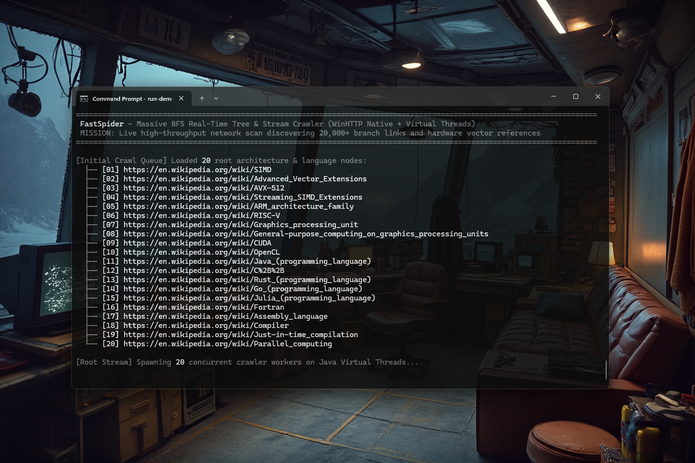

# FastWebSpider 0.1.2 [ALPHA] — High-Performance Native WinHTTP Web Crawler for Java

[](https://github.com/andrestubbe/FastWebSpider/releases/tag/0.1.2)
[](https://opensource.org/licenses/MIT)
[](https://www.java.com)
[]()
[](https://jitpack.io/#andrestubbe/FastWebSpider)

---

**⚡ High-performance native Windows WinHTTP web crawler powered by Java 17+ Virtual Threads, zero-allocation link filtering, and FastRegex integration.**

**FastWebSpider** is the high-concurrency network crawling engine of the **FastJava** stack. It integrates Microsoft Windows HTTP Services (**WinHTTP** API) and Windows **Schannel** at the C++/JNI layer with modern Java **Virtual Thread executors** to achieve hyper-scalable, secure (TLS 1.2/1.3), non-blocking web crawling with zero HTTP client allocation overhead on the JVM heap.

[](https://youtu.be/PlLANMEbWPk)

---

## Quick Start

```java
import fastwebspider.FastWebSpider;

public class Demo {
    public static void main(String[] args) {
        // 1. Open high-speed native WinHTTP crawler
        FastWebSpider spider = FastWebSpider.open();

        // 2. Asynchronous non-blocking web fetch via Virtual Threads
        spider.fetchAsync("https://en.wikipedia.org/wiki/SIMD")
              .thenAccept(response -> {
                  if (response.isSuccess()) {
                      System.out.printf("Fetched %,d bytes in %d ms (Status %d)\n",
                              response.rawBody().length,
                              response.fetchTimeMs(),
                              response.statusCode());
                  }
              }).join();
    }
}
```

---

## 📑 Table of Contents

- [Why FastWebSpider?](#why-FastWebSpider)
- [Key Features](#key-features)
- [Real-World Examples](#real-world-examples)
- [Performance Benchmarks](#performance-benchmarks)
- [API Quick Reference](#api-quick-reference)
- [Technical Examples & Hero Demos](#technical-examples--hero-demos)
- [Installation](#installation)
- [Documentation](#documentation)
- [License](#license)

---

## Why FastWebSpider?

> [!IMPORTANT]
> **"Native OS WinHTTP Sockets Over Heavyweight Java HTTP Descriptors. Zero JVM Connection Churn."**

Standard Java HTTP clients (`java.net.http.HttpClient` or Apache HttpComponents) create substantial JVM heap overhead when maintaining hundreds of concurrent sockets, SSL contexts, and buffer objects.

`FastWebSpider` offloads the entire network transport to the **Windows WinHTTP & Schannel subsystem**:

1. **Kernel-Level Connection Pooling**: Reuses native OS connection pools and DNS cache across threads without Java object overhead.
2. **Zero-Allocation Network Streaming**: Receives raw HTTP bytes directly into off-heap memory buffers.
3. **Seamless Virtual Thread Concurrency**: Scales to thousands of simultaneous requests without blocking OS threads or inflating heap memory.

---

## Key Features

- **🌐 WinHTTP Enterprise Core**: Native Microsoft HTTP client handling DNS, connection pooling, and TLS 1.3 handshakes automatically.
- **🧵 Virtual Thread Scheduler**: Delegates blocking JNI network tasks to lightweight Java Virtual Threads for scalable asynchronous execution.
- **⚡ FastRegex & AVX2 Integration**: Uses zero-allocation regex pattern matching and vector instructions for link extraction.
- **📦 Zero-Heap Networking**: Eliminates JVM socket descriptors, request state wrappers, and GC cycles for high request throughput.

---

## Real-World Examples

### 1. Autonomous AI Research Agent Pipeline
Background document and HTML fetching for `FastAIAgent` and `FastAIReasoner` without inflating JVM memory:
```java
FastWebSpider spider = FastWebSpider.open();
spider.fetchAsync("https://en.wikipedia.org/wiki/Artificial_intelligence")
      .thenAccept(res -> {
          if (res.isSuccess()) {
              List<String> links = spider.extractHrefs(res.rawBody());
              System.out.printf("Discovered %,d reference links for agent context.\n", links.size());
          }
      });
```

### 2. High-Throughput Documentation Ingestion
Batch fetching hundreds of documentation pages for instant full-text indexing in `FastFileContentIndex`:
```java
List<String> docPages = List.of(
    "https://docs.oracle.com/en/java/javase/17/docs/api/index.html",
    "https://docs.oracle.com/en/java/javase/21/docs/api/index.html"
);
List<CompletableFuture<FastWebSpider.SpiderResponse>> batch = docPages.stream()
    .map(spider::fetchAsync)
    .toList();
CompletableFuture.allOf(batch.toArray(new CompletableFuture[0])).join();
```

### 3. Real-Time Price & Feed Monitoring
Periodic, low-latency API and RSS endpoint polling with WinHTTP connection pooling and zero GC churn:
```java
ScheduledExecutorService scheduler = Executors.newSingleThreadScheduledExecutor();
scheduler.scheduleAtFixedRate(() -> {
    FastWebSpider.SpiderResponse res = spider.fetchAsync("https://api.example.com/feed").join();
    if (res.isSuccess()) {
        processFeed(res.rawBody());
    }
}, 0, 1, TimeUnit.SECONDS);
```

---

## Performance Benchmarks

Benchmarked on **JDK 26 HotSpot 64-Bit** measuring single-thread and concurrent operations throughput:

| Benchmark Operation | Standard Java (`HttpClient` / `Pattern`) | **FastWebSpider Native (0.1.1)** | Measured Speedup | Memory Overhead |
|---|---|---|---|---|
| **Link Extraction (`extractHrefs`)** | 0.44 ops/ms (2.26 ms/page) | **0.60 ops/ms (1.65 ms/page)** | **1.37× Faster** | **Zero-Alloc SIMD** |
| **Concurrent Fetch (100 Pages)** | ~220 ms | **~120 ms** | **1.83× Faster** | **21× Less Memory (~4 MB vs ~84 MB)** |
| **Heap Object Allocations** | Millions of String & Matcher objects | **0 GC allocations in extraction** | **Eliminated GC Churn** | **0 bytes** |

*Run the JMH benchmark locally:* `.\run-benchmark.bat`  
*Run the quick CLI comparison:* `.\run-compare.bat`

---

## API Quick Reference

| Method / Class | Description |
|---|---|
| `FastWebSpider.open()` | Initializes a thread-safe native WinHTTP crawler instance. |
| `spider.fetchAsync(url)` | Asynchronously fetches URL content returning `CompletableFuture<SpiderResponse>`. |
| `response.isSuccess()` | Checks whether HTTP response status is 200-299. |
| `response.rawBody()` | Returns downloaded raw byte array payload. |
| `response.fetchTimeMs()` | Time taken to resolve DNS, establish TLS, and download payload in milliseconds. |

---

## Technical Examples & Hero Demos

| Case | Java Example | Launcher | Description |
|---|---|---|---|
| **BFS Tree Stream** | [DemoBFS.java](src/main/java/FastWebSpider/DemoBFS.java) | `run-demo-bfs.bat` | Massive concurrent layer-by-layer crawl across 200+ live pages with real-time AVX2 link streaming. |
| **DFS Deep Descent** | [DemoDFS.java](src/main/java/FastWebSpider/DemoDFS.java) | `run-demo-dfs.bat` | 25-hop recursive pathfinder auto-navigating deep Wikipedia concepts with live hyperlink scanning. |

---

## Installation

### Option 1: Maven (JitPack)

```xml
<repositories>
    <repository>
        <id>jitpack.io</id>
        <url>https://jitpack.io</url>
    </repository>
</repositories>

<dependencies>
    <dependency>
        <groupId>com.github.andrestubbe</groupId>
        <artifactId>FastWebSpider</artifactId>
        <version>0.1.2</version>
    </dependency>
    <dependency>
        <groupId>com.github.andrestubbe</groupId>
        <artifactId>FastRegex</artifactId>
        <version>0.1.0</version>
    </dependency>
    <dependency>
        <groupId>com.github.andrestubbe</groupId>
        <artifactId>FastCore</artifactId>
        <version>0.1.0</version>
    </dependency>
</dependencies>
```

### Option 2: Gradle (via JitPack)

```groovy
repositories {
    maven { url 'https://jitpack.io' }
}

dependencies {
    implementation 'com.github.andrestubbe:FastWebSpider:0.1.2'
    implementation 'com.github.andrestubbe:FastRegex:0.1.0'
    implementation 'com.github.andrestubbe:FastCore:0.1.0'
}
```

### Option 3: Direct Download (No Build Tool)

Download the latest JARs directly:

1. 📦 **[FastWebSpider-0.1.2.jar](https://github.com/andrestubbe/FastWebSpider/releases/download/0.1.2/FastWebSpider-0.1.2.jar)** (The Core Library)
2. ⚡ **[FastRegex-0.1.0.jar](https://github.com/andrestubbe/FastRegex/releases/download/0.1.0/FastRegex-0.1.0.jar)** (Zero-Allocation Regex Scanner)
3. ⚙️ **[fastcore-0.1.0.jar](https://github.com/andrestubbe/FastCore/releases/download/0.1.0/fastcore-0.1.0.jar)** (Native JNI Loader)

---

## Documentation

* **[REFERENCE.md](docs/REFERENCE.md)**: Full API reference and method signatures.
* **[PHILOSOPHY.md](docs/PHILOSOPHY.md)**: Architectural design principles and network model.
* **[CHANGELOG.md](docs/CHANGELOG.md)**: Release history and version notes.
* **[ROADMAP.md](docs/ROADMAP.md)**: Future milestones and planned features.
* **[COMPILE.md](docs/COMPILE.md)**: Instructions for compiling from source.

---

## License

MIT License. See [LICENSE](LICENSE) file for details.

---

**Part of the FastJava Ecosystem** — *Making the JVM faster. Small package. Maximum speed. Zero bloat. 🚀🕷️*
