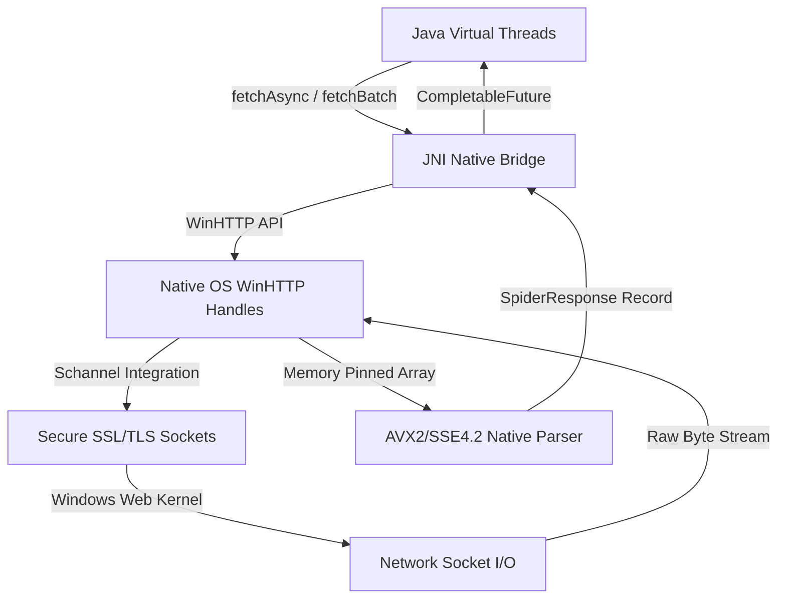

# ⚡ FastSpider Technical & API Reference

FastSpider is a high-performance JNI web crawler that leverages native Windows HTTP Services (WinHTTP), Schannel secure sockets, and AVX2-SIMD parsing. This document provides a complete technical reference for the architecture, networking layers, virtual threads integration, Java API, and native JNI bindings.

---

## 1. Overview & Architecture

FastSpider is designed to achieve absolute maximum throughput on Windows systems by combining native OS sockets and Windows network-stack kernels with modern Java Virtual Threads. 



### Key Architectural Pillars:
*   **Native WinHTTP Kernel Socket Core**: Eliminates JVM Garbage Collection overhead during socket I/O by managing HTTP sessions directly in the Windows web kernel.
*   **Schannel Integration**: Leverages Microsoft's native Security Support Provider (SSP) for TLS/SSL handshakes, maximizing performance and aligning certificates with Windows systems.
*   **Virtual Thread Concurrency**: Uses an unbounded virtual thread executor (`Executors.newVirtualThreadPerTaskExecutor()`) to handle native WinHTTP fetches. Millions of tasks can run concurrently without allocating heavy OS kernel threads.

---

## 2. Core Engine Mechanics & Parallel Fetches

FastSpider processes networking and parsing through a synchronized high-performance lifecycle:

1.  **Session & Connection Management**: Native code initializes a persistent WinHTTP session (`WinHttpOpen`) and establishes a target server connection (`WinHttpConnect`).
2.  **Request & Response Dispatch**: Generates a request handle (`WinHttpOpenRequest`), dispatches headers/queries via secure sockets (`WinHttpSendRequest`), and waits for responses in a lightweight OS wait-state (`WinHttpReceiveResponse`).
3.  **Dynamic Body Buffering**: Streams response chunks natively, resizing internal buffers on the fly to avoid JNI array-copy boundary hops.
4.  **AVX2 Link & Content Extraction**: Invokes vectorized SSE/AVX2 scanning paths directly over the returned bytes inside C++ before marshalling final JVM Strings.

---

## 3. JNI Memory & Handle Life Cycle

*   **Handle Lifetime**: WinHTTP session, connection, and request handles (`HINTERNET`) are automatically closed and released when the native operation completes to prevent resource leaks.
*   **Memory Pinning**: Uses `GetPrimitiveArrayCritical` for AVX2 parser logic to bind memory regions, eliminating standard JNI copying overhead during tag stripping.
*   **Thread Safety**: Fully thread-safe. Multiple Virtual Threads can invoke `fetchAsync` or `fetchBatch` concurrently on a single `FastSpider` instance.

---

## 4. Java API Specification

### `fastspider.FastSpider`

The primary interface representing the native crawler and parser engine.

#### Factory Method
```java
static FastSpider open()
```
Creates and returns a new thread-safe implementation of `FastSpider` (`FastSpiderImpl`).
*   **Returns**: A thread-safe `FastSpider` instance.

---

### Nested Class / Record

#### `FastSpider.SpiderResponse`
```java
public record SpiderResponse(int statusCode, byte[] rawBody, long fetchTimeMs)
```
A lightweight Java Record representing the outcome of a single page request.
*   **Fields**:
    *   `statusCode`: The HTTP status code returned by the server (e.g. `200`, `404`).
    *   `rawBody`: The raw response bytes (typically HTML or JSON).
    *   `fetchTimeMs`: The actual execution duration in milliseconds spent at the native JNI/WinHTTP layer.
*   **Methods**:
    *   `boolean isSuccess()`: Returns `true` if the HTTP status code is a success code (between `200` and `299` inclusive).

---

### Method Specifications

#### 1. `fetchAsync`
```java
CompletableFuture<SpiderResponse> fetchAsync(String url)
```
Asynchronously fetches the content of a single URL.
*   **Behavior**:
    *   Submits the request to the internal Virtual Thread executor.
    *   Invokes native JNI `nativeFetch` without blocking main OS runner threads.
*   **Parameters**:
    *   `url`: The complete HTTP or HTTPS URL to fetch. Cannot be null.
*   **Returns**: A `CompletableFuture<SpiderResponse>` that resolves once the page request finishes.
*   **Throws**: `NullPointerException` if the `url` is null.

#### 2. `fetchBatch`
```java
List<SpiderResponse> fetchBatch(List<String> urls)
```
Synchronously/concurrently crawls a collection of URLs.
*   **Behavior**:
    *   Launches parallel Virtual Threads for every URL.
    *   Blocks the calling thread until all responses are completed.
*   **Parameters**:
    *   `urls`: List of target URLs to scrape. Cannot be null.
*   **Returns**: A non-null `List<SpiderResponse>` in the matching order of the requested URLs.
*   **Throws**: `NullPointerException` if the `urls` list is null.

#### 3. `extractCleanText`
```java
String extractCleanText(byte[] htmlData)
```
Extracts clean, readable visible text from HTML data using native AVX2 vector logic.
*   **Parameters**:
    *   `htmlData`: Raw HTML page bytes. Can be null or empty.
*   **Returns**: Clean plain text formatted for LLM ingestion. Returns `""` if input is empty or null.

#### 4. `extractHrefs`
```java
List<String> extractHrefs(byte[] htmlData)
```
Rapidly extracts all link URLs (hrefs) from HTML data using native AVX2 logic.
*   **Parameters**:
    *   `htmlData`: Raw HTML page bytes.
*   **Returns**: A non-null `List<String>` containing the extracted hyperlinks.

---

### Java Integration Example

```java
import fastspider.FastSpider;
import java.nio.charset.StandardCharsets;
import java.util.List;

public class CrawlExample {
    public static void main(String[] args) {
        // 1. Initialize FastSpider
        FastSpider spider = FastSpider.open();

        // 2. Fetch a single page asynchronously
        spider.fetchAsync("https://github.com/andrestubbe/FastSpider")
            .thenAccept(response -> {
                if (response.isSuccess()) {
                    System.out.println("Fetched in " + response.fetchTimeMs() + " ms");
                    String plainText = spider.extractCleanText(response.rawBody());
                    System.out.println("Natively Cleaned text: " + plainText.substring(0, 100));
                } else {
                    System.err.println("Failed with code: " + response.statusCode());
                }
            }).join(); // Wait for demo async completion

        // 3. Batch crawl multiple URLs concurrently in parallel Virtual Threads
        List<String> batch = List.of(
            "https://github.com/andrestubbe/FastSpider",
            "https://github.com/andrestubbe/FastScrape"
        );

        System.out.println("\nStarting parallel batch crawl...");
        long start = System.currentTimeMillis();
        List<FastSpider.SpiderResponse> results = spider.fetchBatch(batch);
        long end = System.currentTimeMillis();

        System.out.println("Batch crawl completed in " + (end - start) + " ms:");
        results.forEach(res -> {
            System.out.println(" -> Status: " + res.statusCode() + " | Bytes: " + res.rawBody().length + " | Native time: " + res.fetchTimeMs() + "ms");
        });
    }
}
```

---

## 5. Native JNI C++ API Specification

The JNI functions are declared in `fastspider.h` and exported using standard C-linkage.

```cpp
#ifndef FASTSPIDER_H
#define FASTSPIDER_H

#include <jni.h>

#ifdef __cplusplus
extern "C" {
#endif

/*
 * Class:     fastspider_FastSpiderImpl
 * Method:    nativeFetch
 * Signature: (Ljava/lang/String;)Lfastspider/FastSpider/SpiderResponse;
 */
JNIEXPORT jobject JNICALL Java_fastspider_FastSpiderImpl_nativeFetch(
    JNIEnv* env, jobject obj, jstring urlStr);

/*
 * Class:     fastspider_FastSpiderImpl
 * Method:    nativeExtractCleanText
 * Signature: ([B)Ljava/lang/String;
 */
JNIEXPORT jstring JNICALL Java_fastspider_FastSpiderImpl_nativeExtractCleanText(
    JNIEnv* env, jobject obj, jbyteArray htmlData);

/*
 * Class:     fastspider_FastSpiderImpl
 * Method:    nativeExtractHrefs
 * Signature: ([B)[Ljava/lang/String;
 */
JNIEXPORT jobjectArray JNICALL Java_fastspider_FastSpiderImpl_nativeExtractHrefs(
    JNIEnv* env, jobject obj, jbyteArray htmlData);

#ifdef __cplusplus
}
#endif

#endif // FASTSPIDER_H
```

### Native Response Generation Contract
When `nativeFetch` completes, the native C++ layers dynamically instantiate and populate the Java `SpiderResponse` record using JNI Reflection:

```cpp
// Target class and constructor lookup in C++:
jclass responseClass = env->FindClass("fastspider/FastSpider$SpiderResponse");
jmethodID constructor = env->GetMethodID(responseClass, "<init>", "(I[BJ)V");

// Instantiating the record:
jobject responseObj = env->NewObject(responseClass, constructor, statusCode, bodyByteArray, fetchTimeMs);
return responseObj;
```

---

## 6. Platform Support & Concurrency Tuning

### OS Compatibility Matrix
*   **Operating System**: Windows 10, Windows 11 (x86_64). Utilizes kernel-level `winhttp.dll`.
*   **JVM Engine**: Java 17 up to Java 25 (Requires standard JVM execution environments with Virtual Thread enablement).

### Concurrency Recommendations
*   **Max Concurrent Sockets**: Set system properties or configure Windows registry limits (`MaxUserPort` / `TcpTimedWaitDelay`) if crawling more than 10,000 URLs concurrently to avoid operating system ephemeral port exhaustion.
*   **Virtual Threads Configuration**: FastSpider automatically runs task threads using JVM Virtual Threads. There is no need to manually pool or throttle execution threads within your Java application.

---
**Part of the FastJava Ecosystem** — *Making the JVM faster.*
*Made with ⚡ by Andre Stubbe*
